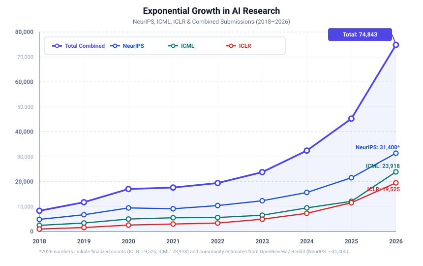
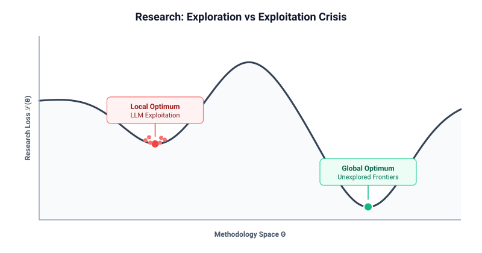
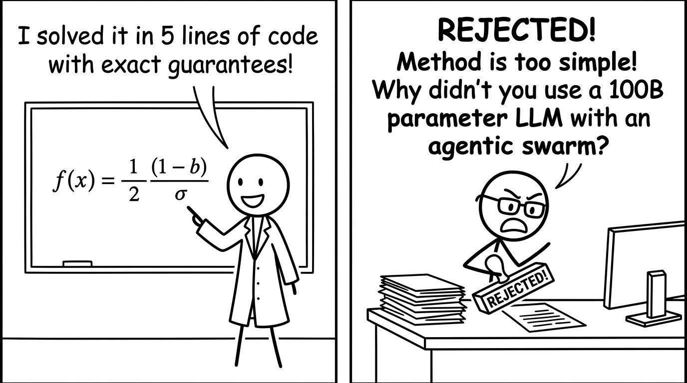
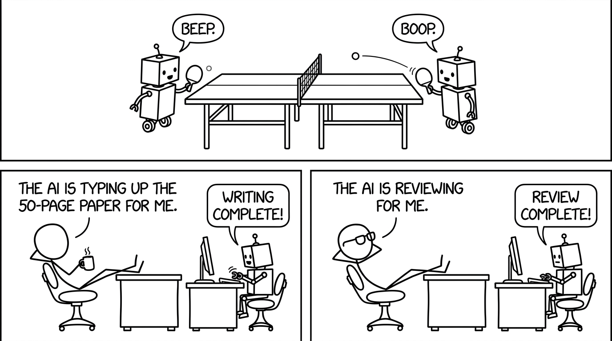

## Exponential Growth of (AI Slop) Paper Submissions

Machine learning is indisputably the most hyper-competitive research discipline in modern science. Over the last decade, major conferences have experienced an exponential surge in paper submissions.
Just recently, ICLR 2027 received over 50,000 submissions according to the submission number of [one Reddit user](https://www.reddit.com/r/MachineLearning/comments/1wks0dv/iclr_2027_submission_50kd/).

At first glance, this does not seem too bad. More papers theoretically imply more researchers, more diverse perspectives, and an accelerated pace of discovery, right? If that many people would contribute to cancer research, nobody would say anything.

In practice, I observed the following trend with the sheer volume of papers:

1. **More Buzzwords**: Every week, there is a new buzzword that every AI researcher must have heard of: **Retrieval-Augmented Generation** (RAG), **State-Space Models** (SSMs/Mamba), **Model Context Protocol** (MCP), **OpenClaw**, **agentic swarms**, **multi-agent architecture (orchestrator, router, handoffs, decentralized)**, and endless foundation model releases from major AI labs (e.g., **Qwen-X, DeepSeek-X, Llama-X, Gemini-X**, and arbitrary **"Any-to-Any" multimodal generators version X**).
Researchers talk about the novel methods intensely and they become prevalent for a few weeks. You are definitely missing out if you don't keep up with the latest buzzwords! **FOMO kicks in!**

2. **Instant Obsolescence**: It is impossible to keep up with all model versions, let alone their incremental improvements every week. But it doesn't matter! You never hear about 90% of them again a few months later.

To succeed as an AI researcher, which is (sadly) defined by the number of publications, you have to keep up with the latest buzzwords and trends! The problem with the fast-paced research in AI/ML is: At the time you are writing your paper based on the latest trend, it's mostly already outdated.

---

## Research as Non-Convex Optimization: The Exploration vs. Exploitation Crisis

Riding on a trend has nowadays become the norm in AI research. My background in optimizing non-convex functions tells me that this is highly problematic. We can formalize research as a **non-convex global optimization problem**:

$$\min_{\theta \in \Theta} \mathcal{L}(\theta)$$

Here, $\Theta$ denotes the infinite parameter space of scientific hypotheses, mathematical frameworks, and algorithms, while $\mathcal{L}(\theta)$ represents the loss till we have solved **Artificial General Intelligence** (AGI). In other words, smaller $\mathcal{L}(\theta)$ means we are closer to AGI.

In classical global optimization (such as simulated annealing, genetic algorithms, or Bayesian optimization), escaping poor local minima requires balancing **exploration** (searching unknown regions of $\Theta$) and **exploitation** (locally refining solutions):

Currently, the AI/ML community is trapped in an extreme **exploitation phase**:

1. **Monoculture of LLMs**: An overwhelming proportion of compute, funding, and authorship is spent fine-tuning, prompting, and assembling wrappers around LLMs. Specifically, only one type of LLMs: **Transformers**.
2. **Acceptance Rate Disparities**: Trending topics like LLMs catch the attention of reviewers and as a result, they have higher acceptance rates than those that are not. So naturally, researchers will focus on trending topics to increase their chances of getting accepted. This is a vicious cycle.
3. **The Exploration Penalty**: Venturing into different paradigms—such as symbolic reasoning, non-gradient optimization, black-box optimization, or evolutionary algorithms—imposes a massive exploratory risk. Reviewers unaccustomed to these methods often penalize such submissions for not benchmarking against a 100-billion parameter foundation model—even if the task is not suited for LLMs.

The field thus risks being stuck in a suboptimal local optimum while missing entirely new scientific discoveries in the vast space of possible solutions.

---

## The "Too Simple" Fallacy & The Curse of Overengineering

One of the most damaging pathologies in peer review is the dismissal of elegant solutions:

> *"The proposed method is too simple/easy. The technical contribution lacks complexity."*

I received this type of review too many times and it's one of the most illogical reviews ever. In mathematics, optimization, and traditional computer science, **simplicity is the key**. If an algorithm requires only 10 lines of closed-form algebra to solve a task with deterministic guarantees, that is not a defect. **Many AI researchers are too used to simply run some deep learning model through a problem**. This may work for many (or even all) cases because neural nets are universal function approximators. But this does not mean that this complex solution is *clever*. In fact, it is the opposite.

### Analogy: LLM as Calculator

Would you use a LLM as a calculator to compute $a+b$ for any numbers $a,b$? Of course not. But this is what many researchers do. They use LLMs to solve problems that can be solved with exact, closed-form methods. LLMs are still probabilistic models, **there is no guarantee for any correct answer**.

But fine-tuning a **generative pre-trained Transformers (GPT) model** with **reinforcement learning from human feedback (RLHF)** to compute $a+b$ for any numbers $a,b$ sounds more complex and thus more "scientific" to reviewers.

---

## The Peer Review Collapse: The AI-vs-AI "Ping-Pong" Loop

Underneath the explosion of 50,000+ submissions per conference (e.g., ICLR 2027) lies an institutional crisis: the total breakdown of the peer review mechanism.

As submission volumes scale exponentially, conference program chairs are forced to recruit an increasingly novice reviewer pool. Many of these newer reviewers have spent their entire school and university years working with LLMs to get through their studies. Unsurprisingly, they favor submissions that match their mental model: large models, heavy compute, and trendy buzzwords.

Hence, the ML community is uniquely vulnerable to **AI Slop**:

Unlike other fields where researchers may use AI tools sporadically, AI researchers are power users. Setting up and automating most of the paper writing process with LLMs is not a hurdle for AI researchers. This creates an absurd closed loop:

1. **Automated Paper Generation**: Authors use agents to generate 10-page papers with bloated introductions, boilerplate methodologies, and hallucinated citations.
2. **Reviewer Fatigue**: Assigned to multiple manuscripts with unrealistic deadlines, overwhelmed reviewers prompt LLMs to summarize the submissions and generate reviews.
3. **The Ping-Pong Game**: **AI writes the paper, and AI reviews the paper.**

When generative models review the outputs of other generative models, journals and conference proceedings are not safe from becoming a collection of AI-generated slop papers.

---

## Key Takeaways

1. **Exploration Over Exploitation**: Chasing trendy topics keeps us trapped in a local optimum. Long-term breakthroughs require exploring unconventional paradigms beyond current dominant trends.
2. **Simplicity Over Complexity**: If a 10-line exact algorithm solves the problem, it is superior to a 100B-parameter wrapper. "Method is too simple" should never be an excuse for rejection.
3. **Exact Guarantees Over Probabilistic Guesses**: Neural nets can approximate anything, but approximations have no guarantees. When exact closed-form math or traditional optimization works, use it.
4. **AI Research is in a Critical Phase**: Too many submissions. Field draws attention to those who are good with AI tools. Peer review requires human intellect. If we let AI write papers and AI review papers, scientific literature loses its credibility.
