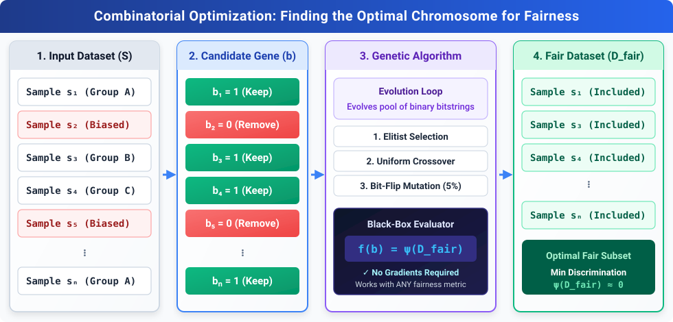

## The Core Problem: Why Traditional Fair ML Falls Short

Most fairness pre-processing methods are tightly coupled to a single mathematical metric (e.g., binary demographic parity) and require differentiable equations to optimize. In real-world applications, however, protected attributes are often **non-binary** (e.g., multi-group ethnicity, nationality), and stakeholders have diverse fairness definitions that lack convenient mathematical gradients.

To solve this, I introduced the concept of **"Fairness-Agnostic"** optimization in our paper [*Towards Fairness and Privacy: A Novel Data Pre-processing Optimization Framework for Non-binary Protected Attributes*](https://doi.org/10.1007/978-981-99-8696-5_8) (published in Springer CCIS, AusDM 2023).

---

## The Key Idea: The Dataset as a Chromosome of 0s and 1s

Instead of redesigning a new algorithm for every fairness formula, we formulate dataset debiasing as a **combinatorial subset selection problem**:

1. Given a dataset $S = \lbrace s_1, s_2, \dots, s_n \rbrace$ of $n$ samples.
2. We define a binary decision vector $b = (b_1, b_2, \dots, b_n) \in \lbrace 0, 1 \rbrace^n$, where:
   * **$b_i = 1$**: Keep sample $s_i$ in the fair dataset $D_{\text{fair}}$.
   * **$b_i = 0$**: Remove sample $s_i$.
   * Thus, the fair dataset is defined as **$D_{\text{fair}} = \lbrace s_i \in S \mid b_i = 1 \rbrace \subseteq S$**
3. Our goal is simply to find the binary sequence (the "chromosome") that minimizes an arbitrary discrimination function $\psi(D_{\text{fair}})$:

$$\min_{b \in \lbrace 0, 1 \rbrace^n} \psi(D_{\text{fair}})$$



---

## Why Black-Box Heuristics (Genetic Algorithms)?

Because the discrimination measure $\psi$ is treated as a **black box**, we only need function evaluations—**no gradients, no derivatives, and no restrictive mathematical assumptions**.

We use **Genetic Algorithms (GAs)** to evolve candidate bitstrings over generations:
* **Candidate Solution**: A chromosome/bitstring of $n$ bits.
* **Selection**: Retain the fittest candidate subsets that yield the lowest discrimination score (Elitist selection).
* **Crossover & Mutation**: Combine promising subset patterns (Uniform Crossover) and flip random bits with a small mutation probability (Bit-Flip Mutation).

Through this evolutionary search, the algorithm automatically discovers the optimal subset of data points that removes bias while preserving data utility.

---

## Experimental Results: Does It Work?

We evaluated our genetic algorithm framework across standard benchmark datasets with non-binary protected attributes: **Adult** (Race: 5 groups), **Bank Marketing** (Job: 12 groups), and **COMPAS** (Race: 6 groups).

Here is an excerpt of the discrimination scores (**Sum of Statistical Disparities**, lower is better) comparing the original unmitigated data against the subset selected by our Genetic Algorithm (Elitist selection):

| Dataset | Protected Attribute | Original Bias | **Our Method** | Bias Reduction (relative) |
| :--- | :--- | :---: | :---: | :---: |
| **Adult** | Race (5 groups) | `0.97` |**`0.25`** | **-74.2%** |
| **COMPAS** | Race (6 groups) | `1.89` | **`0.20`** | **-89.4%** |
| **Bank** | Job (12 groups) | `4.81` | **`1.41`** | **-70.7%** |

*All experiments were averaged over 15 independent runs with minimal runtime (under a few minutes on up to 41,000+ records).*

---

## Key Takeaways

1. **Fairness-Agnostic Flexibility**: Treat any fairness metric as a black-box evaluator. Plug in any group fairness, individual fairness, or custom metric without changing the solver.
2. **Beyond Binary Groups**: Works seamlessly with multi-group and intersectional attributes.
3. **Data Privacy Use Case**: The framework also allows optimizing over purely synthetic datasets ($S = \text{Synthetic Data}$) or merging real with synthetic data ($S = \text{Real Data} \cup \text{Synthetic Data}$), allowing data providers to share debiased data without leaking sensitive real records.

---

## Try it out in Python

This framework is open-source and available on PyPI via the [`fairdo`](https://github.com/mkduong-ai/fairdo) library:

```bash
pip install fairdo
```

```python
from fairdo.preprocessing import DefaultPreprocessing
from fairdo.utils.dataset import load_data

# Load dataset (pandas DataFrame)
data, label, protected_attributes = load_data('compas', print_info=False)

# Automatically find the fair subset using Genetic Algorithm
preprocessor = DefaultPreprocessing(
    protected_attribute=protected_attributes[0],
    label=label
)
data_fair = preprocessor.fit_transform(dataset=data)
```

* **Paper**: [Towards Fairness and Privacy: A Novel Data Pre-processing Optimization Framework for Non-binary Protected Attributes (Springer)](https://doi.org/10.1007/978-981-99-8696-5_8)
* **Code & Documentation**: [github.com/mkduong-ai/fairdo](https://github.com/mkduong-ai/fairdo)
